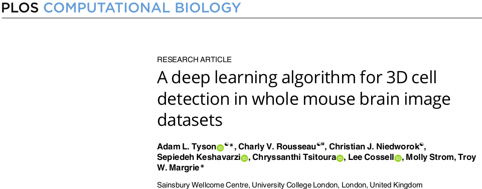
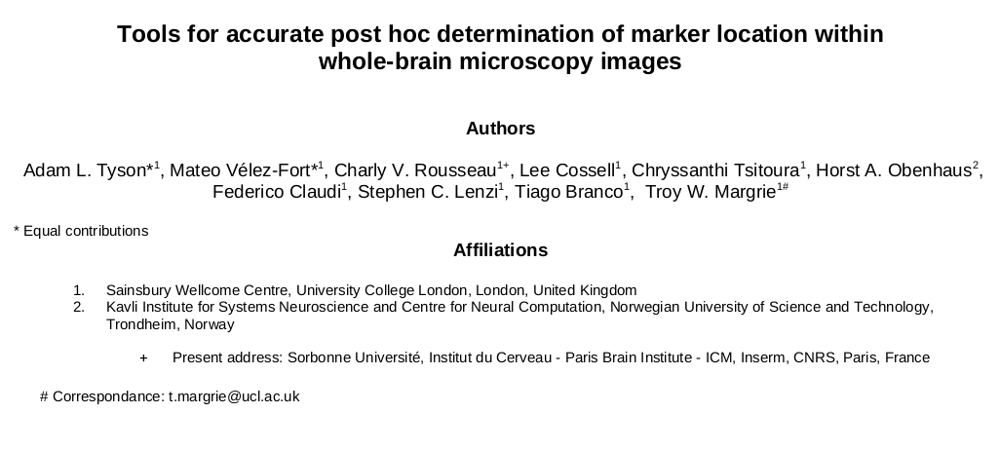

# BrainGlobe's publications

### BrainGlobe Atlas API: a common interface for neuroanatomical atlases

**Link:** [10.21105/joss.02668](https://joss.theoj.org/papers/10.21105/joss.02668.pdf)

### Brainrender.A python based software for visualisation of neuroanatomical and morphological data.

**Link:** [https://doi.org/10.1101/2020.02.23.961748](https://doi.org/10.1101/2020.02.23.961748)

### 

### 

### A deep learning algorithm for 3D cell detection in whole mouse brain image datasets

**link:** [https://doi.org/10.1371/journal.pcbi.1009074](https://doi.org/10.1371/journal.pcbi.1009074)

### Tools for accurate post hoc determination of marker location within whole-brain microscopy images

**Link:** [https://doi.org/10.1101/2021.05.21.445133](https://doi.org/10.1101/2021.05.21.445133)

