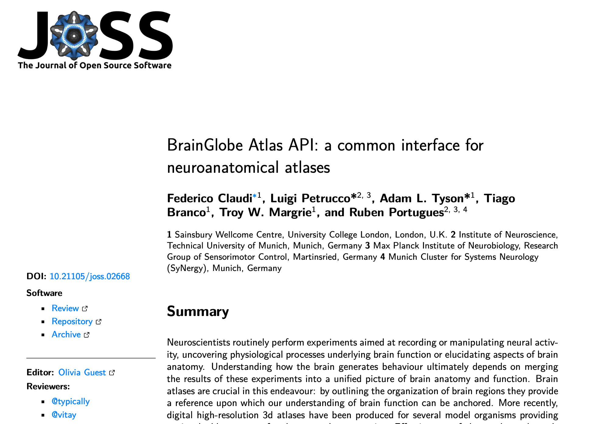
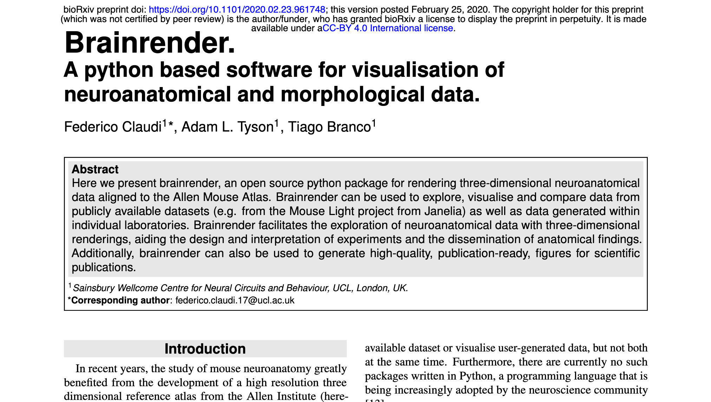
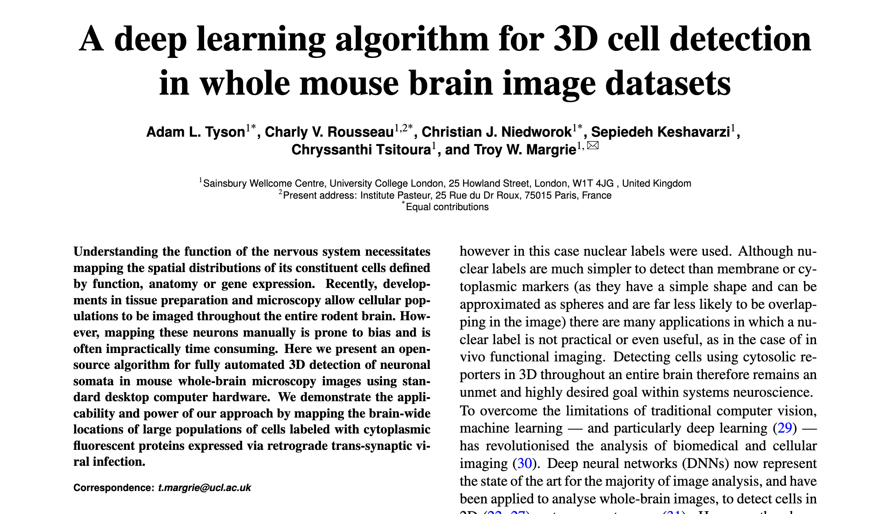

# BrainGlobe's publications

### BrainGlobe Atlas API: a common interface for neuroanatomical atlases

**Link:** [10.21105/joss.02668](https://joss.theoj.org/papers/10.21105/joss.02668.pdf)

### Brainrender.A python based software for visualisation of neuroanatomical and morphological data.

**Link:** [https://doi.org/10.1101/2020.02.23.961748](https://doi.org/10.1101/2020.02.23.961748)

### 

### 

### A deep learning algorithm for 3D cell detection in whole mouse brain image datasets

**link:** [https://doi.org/10.1101/2020.10.21.348771](https://doi.org/10.1101/2020.10.21.348771)

