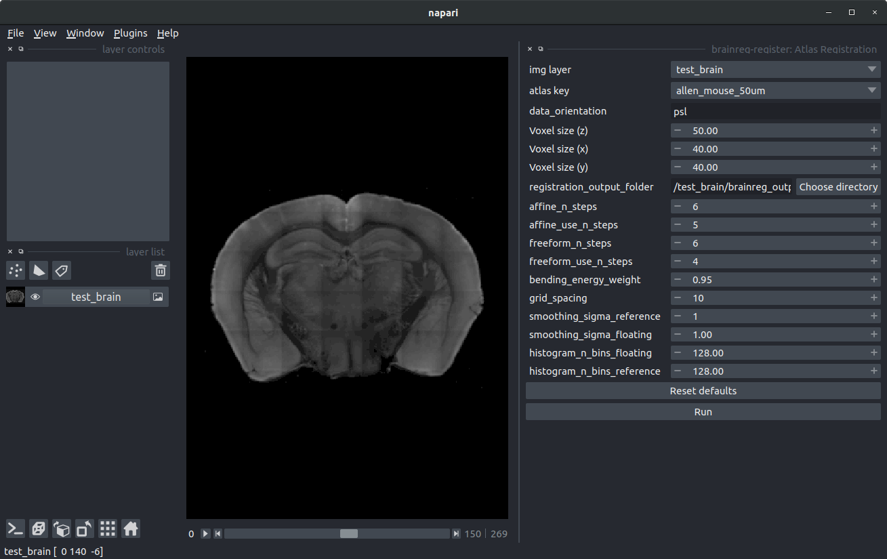

# Tutorial

To test out brainreg, we supply a small mouse brain dataset to get you started.


N.B. This tutorial uses the same data as the [tutorial for the command-line version](https://docs.brainglobe.info/brainreg/tutorial).


## Instructions:

### Setting up

* Download the data from [here](https://gin.g-node.org/cellfinder/data/raw/master/brainreg/test\_brain.zip) (the dataset is \~10MB, so it should download quickly).
* Unzip the data to a directory of your choice (doesn't matter where). You should end up with a directory called `test_brain` with 270 `.tif` images
* Open napari

### Run brainreg

To run the brainreg napari plugin, you need to know:

* What data you want to register (in this case, it's the  `test_brain` directory)
* Where you want to save the output data (we'll just save it into a directory called `brainreg_output`in the same directory as the `test_brain`)
* The pixel sizes of your data in microns (see [Image definition](../cellfinder/image-orientation.md) for details). In this case, our data is 40um per pixel in in the coronal plane and the spacing of the planes is 50um.
* The orientation of your data. The software needs to know how you acquired your data (coronal, saggital etc.). For this cellfinder uses [bg-space](https://github.com/brainglobe/bg-space). Full details on how to enter your data orientation can be found [here](https://docs.brainglobe.info/brainreg/user-guide#input-data-orientation), but for this tutorial, the orientation is `psl`, which means that the data origin is the most **p**osterior, **s**uperior, **l**eft voxel. For more details see [Image definition](../cellfinder/image-orientation.md)
* Which atlas you want to use (you can see which are available by running `brainglobe list`. In this case, we want to use a mouse atlas (as that's what our data is), and we'll use the 50um version of the [Allen Mouse Brain Atlas](https://mouse.brain-map.org/static/atlas).&#x20;


Normally the 50um mouse atlases are only used for testing (the registration will work much quicker at lower resolution). In this case, the test input data is very low resolution, so using a higher resolution atlas doesn't make much sense.

When using your own data, you'll probably (but not definitely) find that higher resolution atlases work better. Make sure to test out the different resolutions to see what works best


To run brainreg, we firstly need to load the data, by dragging and dropping the `test_brain` directory into the main napari window. Then load the plugin by selecting `brainreg-register: Atlas registration` from the napari `Plugins` menu.&#x20;

In the plugin, set all the necessary parameters:

* `Image layer` - Set this to the `test_brain` image layer
* `Atlas` - Set this to `allen_mouse_50um`
* `Data orientation` - Set this to `psl`
* `Voxel size (z)` - Set to 50
* `Voxel size (x)` - Set to 40
* `Voxel size (y)` - Set to 40
* `Output directory` - Click `Choose directory`, and create a new directory in the same directory as `test_brain` called `brainreg_output`

Make sure the image layer is deselected on the left hand side, and then you should see something like this (N.B. the visualised plane and the contrast of the brain has been adjusted):



You can then click `Run`, and the registration will start. Lots of stuff will get printed to the console as brainreg runs, and when it's done (it should only take a minute or so), you will see something like:

```
INFO - MainProcess cli.py:230 - Finished. Total time taken: 0:00:29.15
```

This means that the registration is complete, but you should see the results appear in the napari window.

