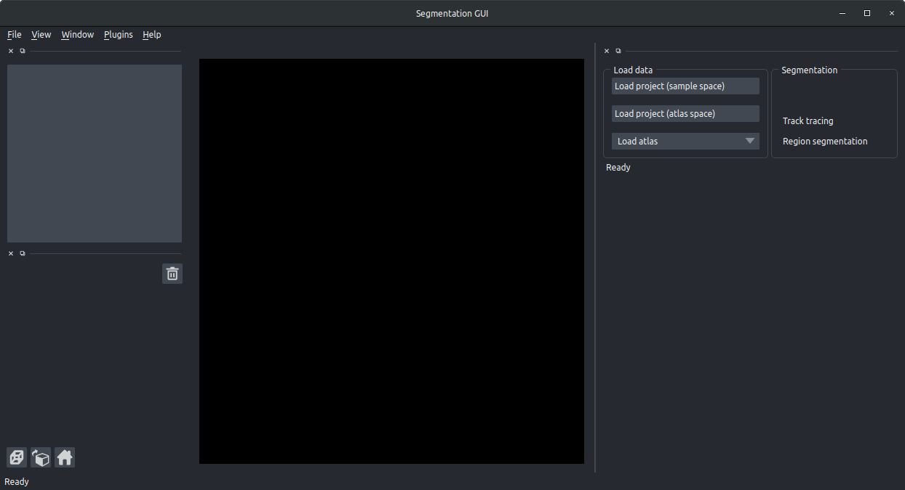

# User guide

### Prerequisites

Your data must have been registered to an atlas using [brainreg](../brainreg/introduction.md) \(or the brainreg-based registration within [cellfinder](../cellfinder/introduction.md).

Please follow the instructions for these packages, and ensure that the channel that you want to segment is downsampled \(e.g. using the `--downsample` flag in brainreg\).

## Usage

To load the software, just type `brainreg_segment` into your command window.

A [napari](https://github.com/napari/napari) viewer will then open, with some options for loading data:

### **To load your data**

There are three options for loading your data \(in the `Load data` section of the GUI\):

* `Load project (sample space)` - This is for loading a brainreg project in the coordinate space of your raw data \(i.e not warped to the atlas space\). N.B. the data will have been reoriented to the orientation of your chosen atlas, but it can be reoriented using the napari button in the bottom left \(a cube with an arrow above it\). **Click this button, then choose your brainreg \(or cellfinder registration\) output directory.**
* `Load project (atlas space)` - As above, but the data loaded will have been warped into the atlas space. This is most useful when you want to visualise your segmented structures in [brainrender](https://github.com/BrancoLab/brainrender), as they must be in atlas space to do so. **Click this button, then choose your brainreg \(or cellfinder registration\) output directory.**
* `Load atlas` If you don't have your own data registered to the atlas, then you can just load the atlas. Useful for making visualisations etc. **Click this drop-down menu, then pick an atlas.**

### **Navigating**

Your data will then appear as a napari "Layer" on the right hand side, and will include your sample data \(including any additionally downsampled channels\), and the atlas. If you select the atlas layer and make it visible \(by toggling the eye icon\), hovering over a brain region will show the region in the bottom left corner**.**

You can navigate around the volume:

* Use the scroll bar at the bottom \(or left/right keys\) to navigate through the image stack
* Use the mouse scrollwheel to zoom in or out
* Drag with the mouse the pan the view

You can adjust the view of your image, by selecting its "layer" in the sidebar, there you can change the gamma enhancement, contrast limits \(right click for finer control\) and the colormap used.

The buttons directly below the layers can be used to rotate the data, reset the view and view in 3D.

### Segmenting 1D tracks

To segment a 1D track, such as a fibre track, or a silicone probe track, select the `Track tracing` button in the `Segmentation panel`.


For more information about how to process silicon probe tracks, please see [Silicon probe tracking](applications/silicon-probe-tracking.md).


Then:

* Click the `Add track` button
* If required, rename the track \(by selecting the `track_0` text\)
* Navigate to where you want to draw your region of interest.
* Make sure the add points mode is activated \(by selecting the `+` symbol\)
* Trace your track by adding points along it. You can add as many, or as few as you like, and this can be done in 3D by changing the viewer plane as you go along.


Make sure you select the points in the order you wish them to be joined


* Repeat the above for each track you wish to trace
* If the brain surface is damaged, you may not be able to trace perfectly from the surface. If you want to add an additional first point at the surface of the brain, click `Add surface points`. Selecting this option will add an additional point at the closest part of the brain surface to the first point, so that the track starts there.  
* The points can then be joined using spline interpolation by clicking `Trace tracks`. You can change:
  * `Fit degree`- what order spline fit to use \(the default is 3, cubic\)
  * `Spline smoothing` - how closely or not to fit the points \(lower numbers fit more closely, for a less smooth interpolation\)
  * `Spline points` - this doesn't affect the interpolation, but determines how many points are sampled from the interpolation \(used for the summary\)
  * `Summarise`- defaults to on, this will save a csv file, showing the brain area for each part of the interpolated track \(determined by `Spline points` \)
  * `Add surface point` If the brain surface is damaged, you may not be able to trace perfectly from the surface. Selecting this option will add an additional point at the closest part of the brain surface to the first point, so that the track starts there.

You will then see a the track fit appear in the napari window, and a `.csv` file will be saved, showing the brain region for every spline point along the track.

You can also use `Save` to save your points to be reloaded at a later date, and if you loaded your data in atlas space, you can also export the track to [brainrender](https://github.com/BrancoLab/brainrender) \(if you're using the brainrender GUI, use the `Load cells` button to load the track\).


All data will be saved into your brainreg output directory


## Segmenting 3D structures

To segment a 3D \(or 2D\) structure, such as an injection site, select the `Region Segmentation` button in the `Segmentation panel`.

Then:

* Click the `Add region` buttons
* If required, rename this region \(by selecting the e.g. `region_0` text\)
* Navigate to where you want to draw your region of interest.
* Choose a brush size \(top left box\). N.B. this is in 3D.
* Make sure painting mode is activated \(by selecting the paintbrush, top left\). You can go back to the navigation mode by selecting the magnifying glass.
* Colour in your region that you want to segment, ensuring that you make a

  solid object.

* Add a new region if required \(`Add region`\)
* Repeat above for each region you wish to segment.
* Click `Analyse regions` to analyse the spatial distribution of the regions you have drawn.
  * If `Calculate volumes` is selected, the volume of each brain area included in the segmented region will be calculated and saved.
  * If `Summarise volumes` is selected, then each region will be summarised \(centers, volumes etc\)

You can also use `Save` to save your regions to be reloaded at a later date, and if you loaded your data in atlas space, you can also export the regions to [brainrender](https://github.com/BrancoLab/brainrender) \(if you're using the brainrender GUI, use the `Add from file` button to load the track\).

