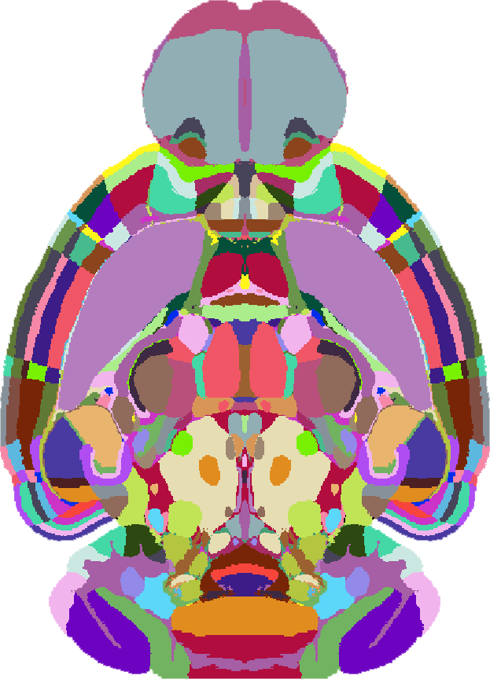

# Image definition

## Voxel sizes

You must also specify the size of your voxels, using the `--voxel-sizes` or `-v` flags. These voxel sizes are in microns, and come in the same order as your orientation definition.&#x20;

As an example, we will assume, as above, the origin of your data (first, top left voxel) is the most anterior, superior, left part of the brain. If your plane spacing (i.e. the z-depth is 5 microns), and your in-plane resolution is 2x2 microns, then you would use:\


```
-v 5 2 2
```

## Orientation

You must specify the orientation of your data by using the `--orientation` flag. What follows must be a string in the [bg-space](https://github.com/brainglobe/bg-space) "initials" form, to describe the origin voxel.

When you work with a stack, the origin is the upper left corner when you show the first element `stack[0, :, :]` with matplotlib or when you open the stack with ImageJ. First dimension is the one that you are slicing, the second the height of the image, and the third the width of the image.

If the origin of your data (first, top left voxel) is the most anterior, superior, left part of the brain, then the orientation string would be "asl" (anterior, superior, left), and you would use:&#x20;

```
--orientation asl
```

The order of the three initials must be the same as the axis order (sliced plane, height, width).

For help with setting the orientation. The brainreg napari plugin comes with a tool to interactively check the orientation ([see documentation](https://docs.brainglobe.info/brainreg-napari/checking-orientation)).

### Examples




